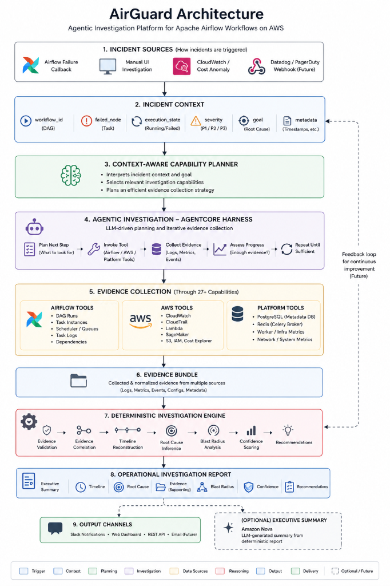

# AirGuard


**AirGuard** is an Agentic Workflow Investigation Copilot designed to autonomously investigate pipeline failures, correlate telemetry across Apache Airflow and AWS, and dispatch actionable, interactive operational reports to Slack. 

Built on a hybrid architecture, AirGuard eliminates LLM hallucinations by splitting responsibilities: the LLM acts strictly as a "Detective" to gather evidence, while a Deterministic Python Engine acts as the "Judge" to synthesize the Root Cause.

## 🌟 Key Architecture & Features

### 1. The Detective vs. Judge Pattern
We strictly separate evidence collection from root cause analysis:
*   **The Detective (AgentCore Harness):** An iterative LLM loop that dynamically queries Airflow APIs, AWS CloudWatch, CloudTrail, and Cost Explorer using atomic, highly-scoped Python tools.
*   **The Judge (Deterministic Engine):** A strict rules-based correlation engine that parses the normalized boolean signals returned by the tools to confidently deduce the Root Cause without hallucination.

### 2. Action-Oriented Slack Dispatch
AirGuard turns read-only notifications into resolution interfaces. Operational reports are dispatched to Slack using **Block Kit UI**. When AirGuard recommends an action (e.g., clearing a transient task state), SREs can click **Approve** directly in Slack. A webhook routes back to AirGuard, securely logging the decision and laying the groundwork for automated remediation.

### 3. Cross-Domain Corroboration
To build high confidence, AirGuard calculates scores based on cross-domain evidence. An Airflow log suggesting a "timeout" yields medium confidence, but when correlated with a massive simultaneous spike in AWS Lambda duration metrics, confidence dynamically boosts to 95%.

### 4. Banning Raw Log Dumps
LLM context windows blow up when fed raw Airflow stack traces. Our **Atomic Evidence Tools** parse API responses locally and pass only strictly-typed JSON (e.g., `{"contains_oom_kill": True}`) to the LLM—saving massive amounts of tokens and enhancing security against prompt injection.

---

## 🚀 Quick Start & Demo

AirGuard is containerized for instant local deployment.

### 1. Set Up Your Environment
```bash
git clone https://github.com/your-org/AirGuard.git
cd AirGuard

# Configure your environment
echo "AWS_ACCESS_KEY_ID=xxx" >> .env.local
echo "AWS_SECRET_ACCESS_KEY=xxx" >> .env.local
echo "AWS_DEFAULT_REGION=us-east-1" >> .env.local
echo "SLACK_WEBHOOK_URL=https://hooks.slack.com/services/xxx" >> .env.local
```

### 2. Spin Up the Infrastructure
Boot up Apache Airflow, PostgreSQL, Redis, and the AirGuard FastAPI backend.
```bash
docker compose up -d --build
```

### 3. Launch the Dashboard
Start the Next.js frontend to visualize the agent's thought process.
```bash
cd frontend
npm install
npm run dev
# Open http://localhost:3000
```

---

## 🎬 Try The Demo Scenarios

We've pre-loaded Airflow with specific scenarios to demonstrate AirGuard's cross-domain reasoning, such as the **Phantom Retraining Storm** and the **SageMaker Timeout Loop**.

👉 **[View the full demo walkthroughs and instructions here](docs/DEMO_SCENARIOS.md)**

---

## Development

- **Run Tests**: `pytest backend/tests/ -v`
- **Formatting**: `black backend/`
